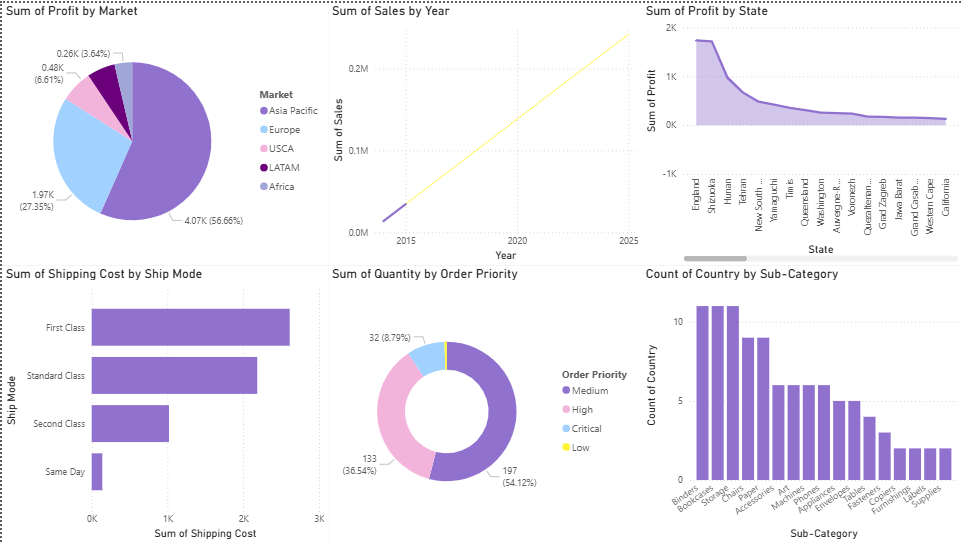

# Sales Dashboard 📊

## 📊 Overview
This project presents an interactive Power BI dashboard analyzing sales performance, trends, and key business metrics.

## 🛠️ Tools
- Power BI

## 📈 Key Insights
- Analyzed sales trends over time
- Identified top-performing categories/products
- Compared performance across different segments
- Provided insights to support business decisions

## 📊 Dashboard Preview

## 📂 Files
- `sales-dashboard.pbix` → Power BI file
- `images/` → Dashboard screenshots

## 🚀 How to Use
- Download the `.pbix` file
- Open it using Power BI Desktop
- Explore the interactive dashboard
